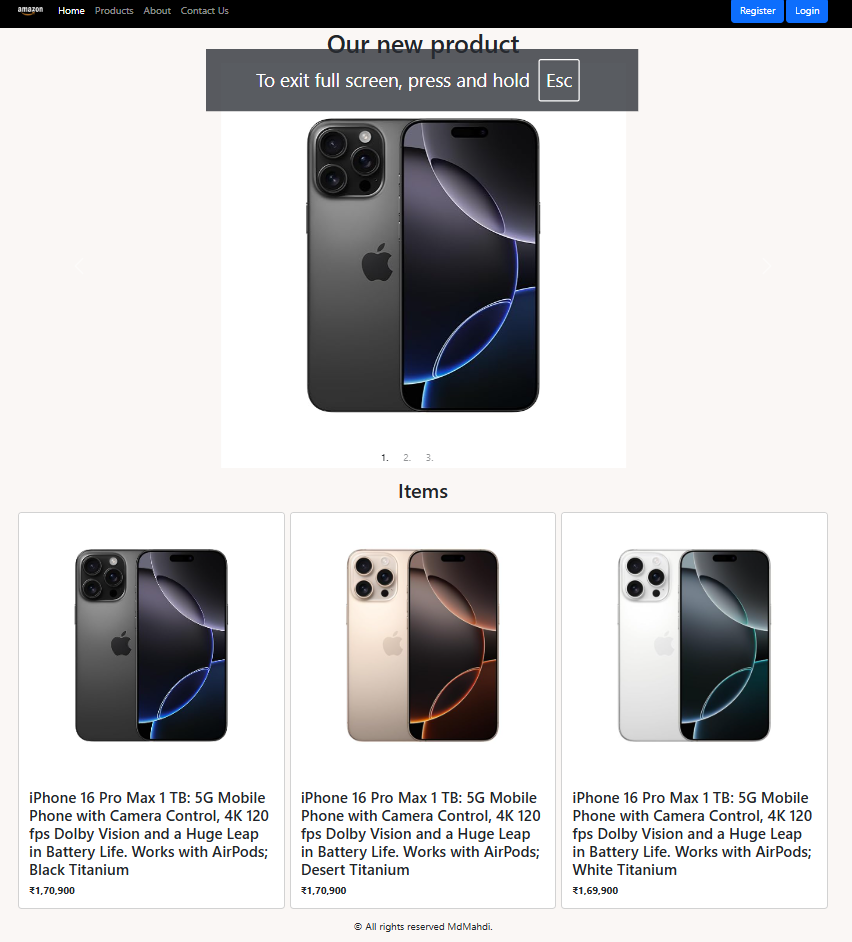
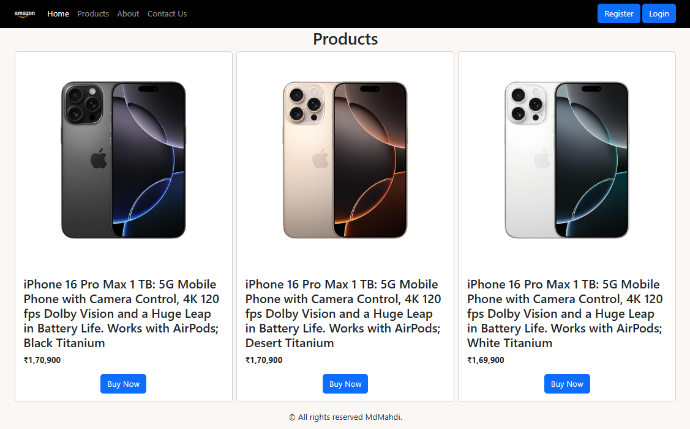
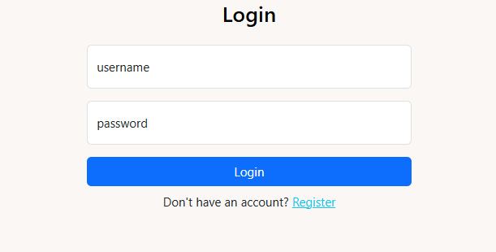
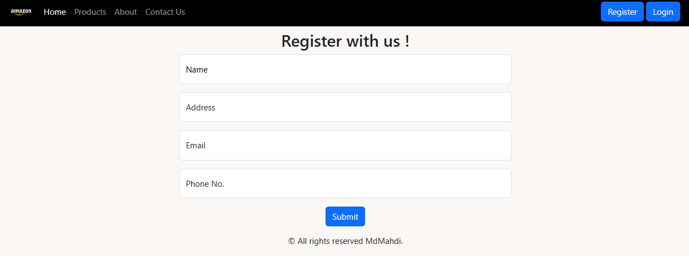
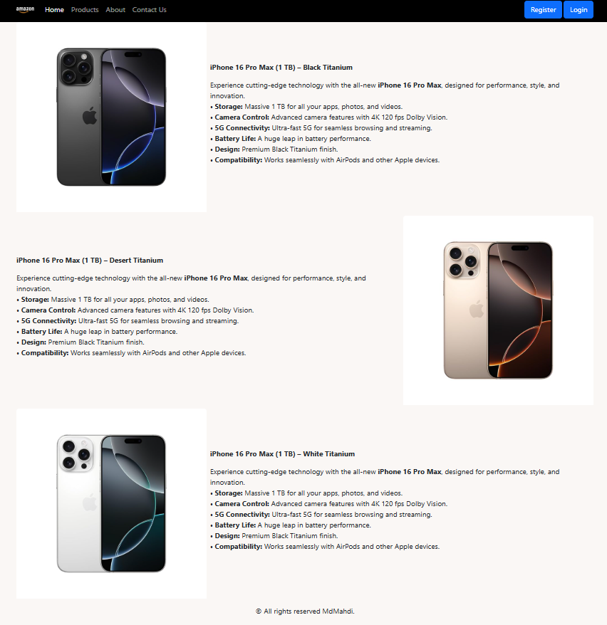

iPhone Product Page – Static Frontend

### 🔗 Live Website

➡️ https://imahdicode.github.io/iPhoneProductPage/

A clean Apple-inspired static website showcasing iPhone product details along with supporting pages like Home, Login, Register, About, and Contact.
Built using pure HTML and CSS to practice layout design, UI structure, and simple frontend workflow.

✨ Features

iPhone-style product display page

Minimal, Apple-inspired UI

Fully static frontend (HTML + CSS)

Pages: Home, Product, Login, Register, About, Contact

Lightweight and fast — no frameworks, no dependencies

📁 Project Structure
home.html → Main landing page  
product.html → iPhone product showcase  
login.html → Demo login page  
register.html → Demo registration page  
about.html → About the site  
contact.html → Contact page  
assets/ → Images, icons, styles (if any)

🚀 How to Run (Local Preview)
Option 1: Direct open

Simply double-click home.html to open it in your browser.

Option 2: Start a local server (recommended)

If you have Python installed:

python -m http.server 8000

Then open:
http://localhost:8000/home.html

This gives more accurate behavior than opening files with file://.

## Screenshots

Preview of the main pages. Click an image to open the full-size screenshot.

<table>
  <tr>
    <td align="center">
      
      
<strong>Home</strong> <em>Main landing page with featured product</em>

    </td>
    <td align="center">
      
      
<strong>Products</strong> <em>Product grid and details</em>

    </td>
    <td align="center">
      
      
<strong>Login</strong> <em>Demo login form</em>

    </td>
  </tr>
  <tr>
    <td align="center">
      
      
<strong>Register</strong> <em>Demo registration form</em>

    </td>
    <td align="center">
      
      
<strong>About</strong> <em>About the demo site</em>

    </td>
    <td align="center">
      
      
<strong>Contact</strong> <em>Contact / support demo</em>

    </td>
  </tr>
</table>

---

🛠️ Tech Used

HTML5

CSS3

(Optional) Small JavaScript enhancements can be added later

📌 Purpose

This project is made for learning, practicing UI design, and showcasing frontend skills in a portfolio.
It’s a great starter template for anyone learning static web development.

📬 Contact

Feel free to open an issue or reach out for improvements or suggestions.
